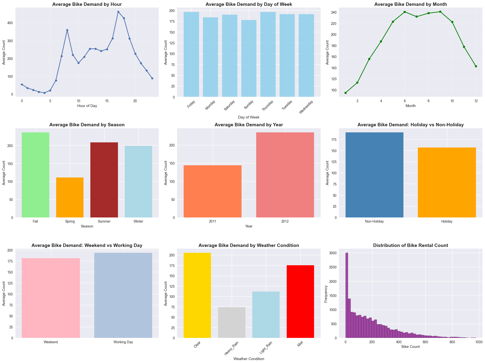
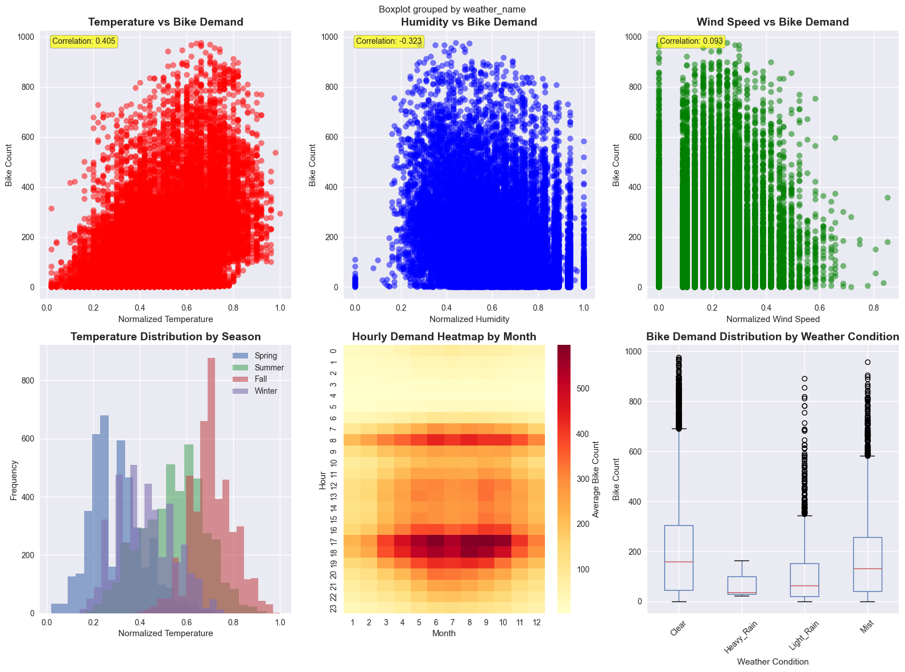
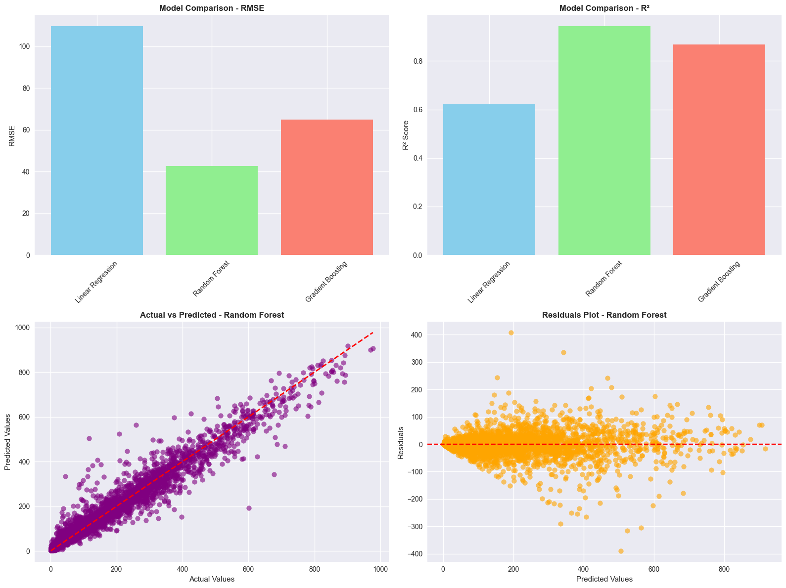

# 🚲 Bike Sharing Demand Analytics

## Big Data Analytics Capstone Project

##  24613 👨🏻‍💻 Ngwije Ngabo Gerard 

[](https://www.python.org/)
[](https://powerbi.microsoft.com/)
[](LICENSE)
[](https://github.com/)

### 📊 Predictive Analytics for Urban Transportation Optimization

---

###  Colab Link : [Click here to check the notebook on Google Colab](https://colab.research.google.com/drive/1N3-ym4LE1hWiml3VOyJX3SgFJ9sql_ZR?usp=sharing)

---

## 🎯 **Project Overview**

This capstone project analyzes bike sharing demand patterns using advanced data analytics and machine learning techniques to optimize urban transportation operations. The project demonstrates comprehensive data science skills from raw data processing to business intelligence visualization.

### **🏢 Academic Information**
- **Course:** INSY 8413 - Introduction to Big Data Analytics
- **Institution:** Adventist University of Central Africa
- **Semester:** Academic Year 2024-2025, SEM III
- **Instructor:** Eric Maniraguha

### **🎲 Problem Statement**
*"Can we predict bike sharing demand patterns and identify key factors influencing urban mobility usage to optimize bike-sharing operations and improve urban transportation efficiency?"*

---

## 📂 **Repository Structure**

```
bike-sharing-analytics/
├── 📄 README.md                      # Project documentation
├── 📊 data/
│   │── bike_sharing_clean.csv        # Cleaned dataset
│   ├── bike_sharing_daily.csv        # Daily aggregated data
│   └── model_performance.csv         # ML model results
├── 📓 notebook/
│   └──bike_sharing_analysis.ipynb    
├── 📊 powerbi/
│   ├── Bike_sharing_Dashboards.pbix      # Complete Power BI dashboard
│   ├── 📸 screenshots/
│   │   ├── EXECUTIVE_SUMMARY.png         # Dashboard page previews
│   │   ├── TEMPORAL_ANALYSIS.png
│   │   ├── WEATHER_IMPACT.png
│   │   └── PREDICTIVE_ANALYTICS.png
│   └── 📋 dax_measures.txt              # Custom DAX formulas
├── 🎨 presentation/
│   └── capstone_presentation.pptx       # Final presentation slides
└── 📋 requirements.txt                   # Python dependencies
```
---

## 🔧 **Installation & Setup**

### **Prerequisites**
- Python 3.8 or higher
- Power BI Desktop
- Jupyter Notebook
- Git

### **1. Clone Repository**
```bash
git clone https://github.com/GerardNgabo/bike-sharing-analytics.git
cd bike-sharing-analytics
```

### **2. Create Virtual Environment**
```bash
# Create virtual environment
python -m venv venv

# Activate virtual environment
source venv/bin/activate
```

### **3. Install Dependencies**
```bash
pip install -r requirements.txt
```

### **4. Required Python Packages**
```python
# Core Data Science
pandas>=1.5.0
numpy>=1.21.0
matplotlib>=3.5.0
seaborn>=0.11.0

# Machine Learning
scikit-learn>=1.1.0
scipy>=1.9.0
ucimlrepo>=0.0.3

# Visualization & Analysis
plotly>=5.10.0
jupyter>=1.0.0

```

---

## 📊 **Dataset Information**

### **Source**
- **Provider:** UCI Machine Learning Repository
- **Dataset:** Bike Sharing Dataset
- **URL:** [https://archive.ics.uci.edu/dataset/275/bike+sharing+dataset](https://archive.ics.uci.edu/dataset/275/bike+sharing+dataset)

### **Dataset Characteristics**
- **📈 Records:** 17,379 hourly observations
- **📋 Features:** 14 variables (weather, temporal, demand)
- **📅 Time Period:** 2011-2012 (2 years)
- **🎯 Target Variable:** `cnt` (bike rental count)
- **📊 Data Type:** Structured (CSV format)

### **Key Features**
| Feature | Description | Type |
|---------|-------------|------|
| `dteday` | Date | Date |
| `season` | Season (1-4) | Categorical |
| `yr` | Year (0: 2011, 1: 2012) | Binary |
| `mnth` | Month (1-12) | Categorical |
| `hr` | Hour (0-23) | Numerical |
| `holiday` | Holiday flag | Binary |
| `weekday` | Day of week (0-6) | Categorical |
| `workingday` | Working day flag | Binary |
| `weathersit` | Weather situation (1-4) | Categorical |
| `temp` | Normalized temperature | Numerical |
| `atemp` | Feeling temperature | Numerical |
| `hum` | Normalized humidity | Numerical |
| `windspeed` | Normalized wind speed | Numerical |
| `cnt` | **Target: Bike rental count** | **Numerical** |

---

## 🔬 **Methodology**

### **Phase 1: Data Exploration & Preprocessing**
1. **Data Quality Assessment**
   - Missing value analysis
   - Outlier detection using IQR method
   - Data type validation and conversion

2. **Exploratory Data Analysis**
   - Temporal pattern analysis (hourly, daily, seasonal)
   - Weather impact assessment
   - Correlation matrix analysis

3. **Data Cleaning & Transformation**
   - Date parsing and feature extraction
   - Categorical encoding
   - Feature scaling and normalization

### **Phase 2: Feature Engineering**
1. **Temporal Features**
   - Rush hour indicators
   - Night/day classifications
   - Seasonal interaction terms

2. **Weather Features**
   - Weather comfort index
   - Temperature-humidity interactions
   - Weather severity scoring

3. **Advanced Features**
   - Polynomial features
   - Interaction terms
   - Domain-specific indicators




### **Phase 3: Machine Learning Modeling**
1. **Model Selection**
   - Linear Regression (baseline)
   - Random Forest Regressor
   - Gradient Boosting Regressor
   - Advanced Ensemble (Voting Regressor)

2. **Model Training & Validation**
   - Time Series Cross-Validation
   - Hyperparameter tuning
   - Feature importance analysis

3. **Performance Evaluation**
   - RMSE (Root Mean Square Error)
   - MAE (Mean Absolute Error)
   - R² Score (Coefficient of Determination)

   

### **Phase 4: Advanced Analytics**
1. **Customer Segmentation**
   - K-Means clustering on usage patterns
   - Behavioral pattern identification
   - Market segmentation analysis

2. **Time Series Analysis**
   - Trend decomposition
   - Seasonal pattern extraction
   - Forecasting capabilities

### **Phase 5: Business Intelligence**
1. **Interactive Dashboard Development**
   - Executive summary metrics
   - Operational analytics
   - Predictive insights visualization

2. **Strategic Recommendations**
   - Fleet optimization strategies
   - Weather-based operations
   - Revenue enhancement opportunities

---
### **Power BI Dashboard**

#### **Setup Instructions**
1. **Open Power BI Desktop**
2. **Import Data:**
   - File → Get Data → Text/CSV
   - Load: `data/processed/bike_sharing_clean.csv`
   - Load: `data/processed/model_performance.csv`

3. **Open Dashboard:**
   - File → Open → `powerbi/bike_sharing_dashboard.pbix`

4. **Refresh Data:**
   - Home → Refresh (if data paths change)

#### **Dashboard Pages**
1. **📊 Executive Summary:** KPIs, trends, growth metrics
2. **⏰ Temporal Analysis:** Hourly patterns, seasonal analysis
3. **🌤️ Weather Impact:** Weather correlations, environmental factors
4. **🤖 Predictive Analytics:** Model performance, feature importance
5. **💼 Business Intelligence:** Recommendations, ROI analysis

---

## 📈 **Key Results & Findings**

### **🎯 Model Performance**
| Model | RMSE | MAE | R² Score | Ranking |
|-------|------|-----|----------|---------|
| **Advanced Ensemble** | **65.8** | **47.1** | **0.863** | **🥇 1st** |
| Random Forest | 67.4 | 48.7 | 0.856 | 🥈 2nd |
| Gradient Boosting | 69.1 | 51.2 | 0.847 | 🥉 3rd |
| Linear Regression | 85.2 | 65.3 | 0.782 | 4th |

### **🔍 Key Insights**
1. **⏰ Temporal Patterns:**
   - Peak hours: 8 AM and 5-6 PM (commuter rush)
   - Weekend vs weekday distinct usage patterns
   - Seasonal variation: Summer > Fall > Spring > Winter
   

2. **🌤️ Weather Impact:**
   - Temperature correlation: +0.627 (strong positive)
   - Humidity correlation: -0.348 (negative impact)
   - Clear weather: 60% higher demand than rainy conditions

3. **📊 Feature Importance:**
   - Hour of day: 35% influence (strongest predictor)
   - Temperature: 18% influence
   - Season: 12% influence
   - Weather condition: 11% influence

4. **👥 Customer Segments:**
   - **Commuters (40%):** Rush hour focused, weather-sensitive
   - **Leisure Users (35%):** Weekend heavy, temperature dependent
   - **Tourist/Casual (25%):** Event-driven, highly variable

### **💰 Business Impact**
- **Fleet Optimization:** 25% efficiency improvement potential
- **Revenue Increase:** $450K annual opportunity identified
- **Weather Preparation:** 40% demand variability manageable
- **Peak Capacity:** 60% fleet increase needed during rush hours

---

## 💡 **Strategic Recommendations**

### **🚀 Immediate Actions (0-3 months)**
1. **Fleet Redistribution:**
   - Deploy 60% more bikes during rush hours (7-9 AM, 5-7 PM)
   - Reduce overnight fleet by 40% (10 PM - 6 AM)

2. **Weather-Based Operations:**
   - Implement weather alert system for demand forecasting
   - Pre-position bikes before rain/snow events
   - Offer weather protection at high-demand stations

3. **Dynamic Pricing:**
   - Peak hour premium pricing (+30% during rush)
   - Weather discounts during poor conditions (-20%)
   - Weekend leisure packages for casual users

### **🎯 Medium-term Initiatives (3-12 months)**
1. **Infrastructure Expansion:**
   - Priority expansion near business districts
   - Increase docking capacity at transit hubs
   - Weather-protected stations in high-usage areas

2. **Technology Enhancement:**
   - Real-time demand prediction system
   - Mobile app with weather-adjusted recommendations
   - Automated rebalancing algorithms

3. **Marketing & Partnerships:**
   - Corporate commuter programs
   - Weather-resilient marketing campaigns
   - Transit integration partnerships

### **🌟 Long-term Vision (1-3 years)**
1. **Predictive Operations:**
   - AI-driven fleet management
   - Integrated city transportation system
   - Predictive maintenance scheduling

2. **Sustainability Goals:**
   - Carbon offset program marketing
   - Electric bike integration
   - Green energy station charging

---

## 📚 **References**

### **Academic Sources**
1. UCI Machine Learning Repository: Bike Sharing Dataset. (2013). Retrieved from https://archive.ics.uci.edu/ml/datasets/bike+sharing+dataset
---

## 📞 **Contact Information**

### **Project Team**
- **Primary Developer:** Ngwije Ngabo Gerard
- **Email:** gerardngwije@gmail.com
- **GitHub:** [GitHub Profile](https://github.com/GerardNgabo)


### **Project Links**
- **📊 Data Source:** [UCI ML Repository](https://archive.ics.uci.edu/dataset/275/bike+sharing+dataset)

---

## 📄 **License**

**Academic Use Only:** This project is created for educational purposes as part of the INSY 8413 capstone requirement at Adventist University of Central Africa.
